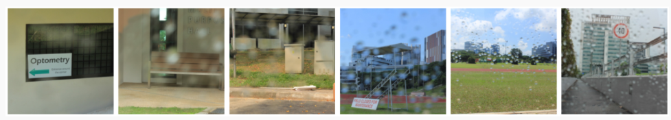
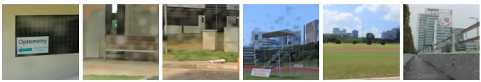

# Raindrop Removal using DDNM

> **Note**: This project is based on the original [DDNM repository](https://github.com/wyhuai/DDNM) by Yinhuai Wang, Jiwen Yu, and Jian Zhang. This fork adapts DDNM specifically for raindrop removal tasks.

---

## Description
- Implemented Zero-Shot Denoising Diffusion Null Model with raindrop masks generated by an Attentive Generative Adversarial Network and an adjusted degradation operator for deblurring with time-travel trick strategy, overcoming non-linear challenges in raindrop removal (Generative AI, PyTorch, kubernetes) 
- Achieved best performance, with simplified denoising using masks and the time-travel trick, resulting in an SSIM of 0.8808 and a PSNR of 28.3650 on Qian et al.'s 2018 Raindrop dataset (Data Test A)

## Demo: Raindrop Removal Results
Images with raindrops degrading the visual quality:



Raindrop masks generated by Attentive GAN to identify raindrop regions:


Restored images after applying DDNM for raindrop removal (Simplified denoising with mask dengan time-travel trick):



### Performance Metrics

Quantitative evaluation results on Qian et al.'s 2018 Raindrop dataset (Data Test A):


These images demonstrate the challenge of raindrop removal - raindrops create complex degradations including blur, occlusion, and distortion that need to be addressed by the restoration model.

---


## 😊Applying DDNM to Raindrop Removal

Implementation of A and its pseudo-inverse Ap:

```python
if args.deg == 'raindrop_mask_old':
    loaded = np.load("exp/inp_masks_raindrop/mask.npy")
    mask = torch.from_numpy(loaded).to(self.device)
    A = lambda z: z*mask
    Ap = A
```

---

# References
```
@article{wang2022ddnm,
title={Zero Shot Image Restoration Using Denoising Diffusion Null-Space Model},
author={Yinhuai, Wang and Jiwen, Yu and Jian, Zhang},
journal={arXiv:2212.00490},
year={2022}}
}
```
This implementation is based on / inspired by:
- https://github.com/wyhuai/RND (null-space learning)
- https://github.com/andreas128/RePaint (time-travel trick)
- https://github.com/bahjat-kawar/ddrm (code structure)
